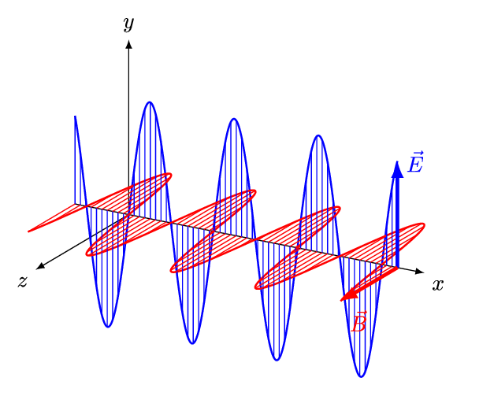
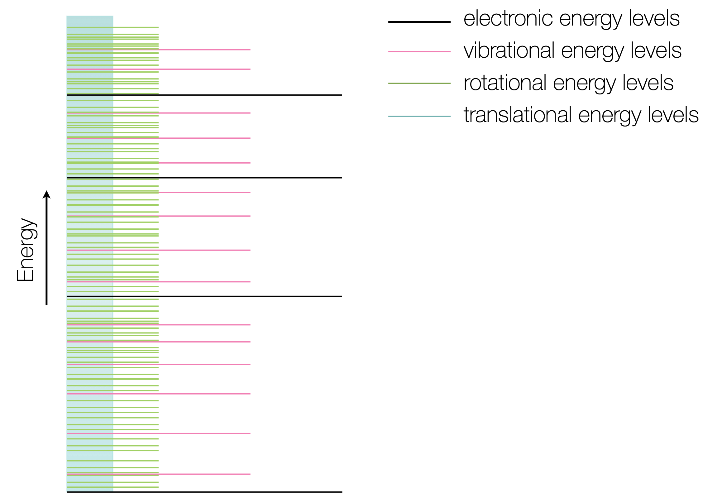

# Introduction to Photochemistry & Photophysics {#chIntro}

Let us open with some context on this course.

Photochemistry is, by definition from IUPAC, ‘the branch of chemistry concerned with the chemical effects of light’^[IUPAC Goldbook, http://goldbook.iupac.org/terms/view/P04588 (accessed July 2020).]. However, in this course we are going to focus on and examine some of the fundamental **photophysics** of system before finally introducing chemical reactions involving light. Photophysics is closely related to what you have previously studied in your first and second years, in that it is a study of the processes of absorption and emission of light and the kinetics of these processes. We will also draw upon your previous studies of quantum mechanics as wavefunctions are vital in our understanding of photophysical processes.

Light is the very reason why there is life on earth, the outstanding beauty of processes such as photosynthesis or vision speak to the power of this branch of chemistry. Photochemistry offers a way for us to ‘cheat’ traditional chemical reactions, in that we no longer need thermal energy to get over an activation barrier, instead we use the energy of a photon. It is only by understanding how we can best utilise the bounteous resource of the sun’s light that we as a species can hope to to have a long and fruitful future on this planet.

It is just over 100 years since quantum theory revolutionised our understanding of matter and light, 125 years since the discovery of the electron, but in that time we have achieved wonderful things, things that have revolutionised the way we live. From lasers in cd and blue ray players to their use in scanning bar codes, glow sticks (fun at festivals, essential in emergencies), or more prosaic uses such as sun creams, self cleaning windows or display technology (where would we be without the phones in our pockets?). In this course you will learn about a range of photophysical and photochemical processes that underpin our modern lives and also learn about some of the current challenges and interests in the field.

**Spectroscopy**

* techniques

**Photochemistry**

* reactions
* molecular structure

**Photophysics**

* kinetics
* thermodynamics
* quantum mechanics


**Photophysical processes**

*transitions which convert between excited states or between an excited state and a ground state of a molecule

**Photochemical processes**

*reactions or rearrangements which occur as a consequence of excitation from the ground state

## Assumed background knowledge

The course relies heavily on first and second year kinetics concepts as well as building on the quantum mechanics from second year and some of the spectroscopy you did in first year. Whilst I have done my best to ensure that there is a minimum of non-physical chemistry content required to get the most out of this course if I want to talk about molecules some very basic knowledge from both organic and inorganic chemistry, much of which will at least have been mentioned at 'A'-level or IB.

I will talk a lot about $\sigma$ and $\pi$ bonding, but this has been covered in quantum mechanics, a double bond has one $\sigma$ and one $\pi$ bond. I will also talk about shape and structure, a carbon with only $\sigma$ bonds is 3 dimensional and tetrahedral, a carbon with 3 $\sigma$ and 1 $\pi$ bond is trigonal planar, and one with 2 $\sigma$ and 2 $\pi$ bonds is linear. 

However we need to think about the fact that a molecular orbital exists over a hole molecule. If we reduce bond order overall we change the shape of the molecule. This will be discussed in the absorption (Chapter \@ref(chAbs)) section of this course.

If you need more help on structure, bonding or metal complexes Chemistry^3^ is an excellent book to start with, or please ask for help.


```{r echo=FALSE, EMWave, out.width='60%', fig.show='hold', fig.align="center", auto_pdf=TRUE, fig.cap="Light as a wave is made up of orthogonal oscillating electric and magnetic fields. From: [And1mu](https://upload.wikimedia.org/wikipedia/commons/9/99/EM-Wave.gif) / [CC BY-SA](https://creativecommons.org/licenses/by-sa/4.0)", fig.alt="The orthogonal electric and magnetic oscillating fields of plain polarised light, propagating along the x-axis."}

```


## Light {#sec:Light}


As you’ve already learnt light exhibits properties that has both a wave like and particle like nature, and our understanding of light was one of the fundamental pieces that lead towards the quantum theory of the atom. Newton had shown that light from the sun is comprised of a spectrum of colours, we now know that that spectrum goes beyond what we can see with our eyes.

```{r echo=FALSE, EMspect, out.width='100%', fig.show='hold', fig.cap='The electromagnetic spectrum of light, frequency and energy are equivalent, so high frequency waves have high energy photons',, fig.alt='The electromagnetic spectrum of light starting at high energy (short wavelength) on the left with x-rays and $\\gamma$-rays running at energies higher than 100 PHz, UV light is next highest in energy running between approximately 100 PHz and 1 PHz. The visible spectrum is then shown as a blow out region with extra detail and wavelengths shown for purple (about 400 nm) to red (about 700 nm) running through from purple to blue, cyan, green, yellow, orange and then red. Infra-red light is show to run from the visible range down to about 100 GHz, followed by microwaves (from around 100 GHz to 500 MHz) and lowest in energy are radio waves occupying all frequencies lower in energy than microwaves. Wavelengths and frequencies are both represented by a logarhymic scale. Each of the regions of the electromagnetic spectra are related to transitions within molecules from very high energy transitinos (in the high energy x-ray and $\\gamma$-ray region) for nuclear transions, to slighly lower energy transitions in the same spectral region of transitions involving core electrons, to transitions involving valence electrons in teh UV and visible region. The IR region covers vibrational transitions, whereas rotational transitions are covered in the microwave region. The lowest energy transitions are covered by the radio wave region of the spectra which is used in NMR spectrscopy which looks at nuclear spin.'}
knitr::include_graphics("images/EMspectrumspectroscopy.png")
```

In your studies you have already seen how large amounts of the electromagnetic spectrum is used for different spectroscopic techniques, making use of the quantised transitions within molecules. For example, infra-red light has the same energy as the vibrational transitions within molecules. In photochemistry, we are specifically interested in the visible and near UV part of the EM spectrum as photons with this energy promote transitions for the valance electrons in the molecules we are interested in.

It is important never to forget the wave particle duality of light, however for much of photochemistry and photophysics it is perhaps simpler to consider the light as a stream of incident photons, whilst there are classical (wave) models to thing of processes like absorption and emission this set of notes will usually defer to an entirely particle model of absportion or emission of a photon.

## Energy levels {#subsec:energylevels}

One of the consequences of quantum theory is that energy levels within atoms and molecules are discrete (figure \@ref(fig:energylevels)). Atoms only have electronic and translational energy levels, whereas molecules have electronic, vibrational, rotational and translational energy levels (in decreasing order of energy steps).

```{r echo=FALSE, energylevels, out.width='60%', fig.show='hold', fig.align="center", auto_pdf=TRUE, fig.cap="Molecules have a number of different energy levels over which the internal energy of a molecule is distributed. Vibrational energy levels are essentially a continuum, however rotational vibrational and electronic levels all have measurable transitions.", fig.alt="Sketch of the energy levels within molecules. Energy is increasing on the y-axis. Translational energy levels are shown as a continuum in blue, slightly longer discrete green lines show rotational energy levels, longer still pink lines have a greater spacing still and indicate vibrational levels within molecules, finally four long black lines represent electronic every levels with the greatest spacing."}

```


As you have seen in figure \@ref(fig:EMspect) these transitions between these energy levels correspond to different parts of the electromagnetic spectrum, however the presence of translational, rotational and vibrational energy levels also has an effect on the transitions between electronic energy levels.

Translations are movement of the whole molecule along the xy&z cartesian coordinates, rotations can be either the whole molecule rotating (along the xy&z axis) or else internal rotations within the molecule. Vibrations include both stretching and bending motions within a molecule.

## Feedback on this resource {-}

<iframe src="https://docs.google.com/forms/d/e/1FAIpQLSeI4QR8aDpXrTA9gBTloje_ipiAon727z-vJ2AkdpCKrwJjag/viewform?embedded=true" width="640" height="1220" frameborder="0" marginheight="0" marginwidth="0">Loading…</iframe>

## Formative questions {#subsec:introqs}

<iframe src="http://workitoutwithapencil.xyz/wp-admin/admin-ajax.php?action=h5p_embed&id=7" width="1147" height="399" frameborder="0" allowfullscreen="allowfullscreen"></iframe><script src="http://workitoutwithapencil.xyz/wp-content/plugins/h5p/h5p-php-library/js/h5p-resizer.js" charset="UTF-8"></script>


