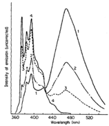

# Other Excited State Systems {#ch:excited}

### Learning Objectives {#sec:exitedLOs}


At the end of this section you should be able to:

- Explain the origin of excimer and exciplex emission spectra.
- Describe why excimer and exciplex formation are concentration dependent.
- Interpret changes in emission spectra with changing concentration to justify formation of either excimers or exciplexes.


## Excimers {#sec:excimers}

An excimer is an excited state dimer formed between two identical molecules. A photon is delocalised between two molecules which in the excited state are weakly bound together. Excimers are relatively long lived species, and were first noticed when increasing the concentration of certain fluorophores. 

It was found that upon increasing the concentration of the chromophore the fluorescence did not increase linearly, and upon reaching higher concentrations the fluorescence decreased; however, this decrease in fluorescence occurred with an increase in a new emission band of lower energy. Excimer bands tend to be broad featureless and Gaussian in profile, figure 33. It is important to note that there is no bonding between the chromophores in the ground state; excimers only occur at high concentrations as an excited state molecule has to interact with a second ground state molecule in the lifetime of the excited state. There is no change in the absorption of the sample (as there is only excitation of monomer species), only formation of a new band in the emission spectrum.

Excimers exist because of formation of a weak bond between the two chromophores as shown in figure \@ref(fig:excimer). By formation of this bond any emission from the excimer has to be lower in energy than the fluorescence of the monomer chromophore. The ground state consists of two molecules in an dissociated state, upon emission from the excimer the structure of the excimer remains (as with the Stokes shift) and the two molecules diffuse apart.

It is important to note that there is no charge separation in the excimer and that the excited state is shared across both molecules.

```{r echo=FALSE, excimer, out.width='70%', fig.show='hold', fig.align='center', fig.cap='The monomer and excimer emission of pyrene, and an energy level profile showing the fluorescence from the non-bonded D* state as well as the excimer emission from the DD* state.'}
knitr::include_graphics("images/excimer.png")
```

```{r echo=FALSE, pyreneexcimer, out.width='70%', fig.show='hold', fig.align='center', fig.cap='A pyrene excimer with a separation of 3.53 Å between the two planes of nuclei, in the excited state dimer the two ring systems of pyrene have a weak interaction between them. The emission maxima of fluorescence is 400 nm whereas the emission maxima for the excimer is 480 nm.'}
knitr::include_graphics("images/pyreneexcimer.png")
```

A concept bite video briefly covering the concepts of eximers and exciplexes (video length 7m05s)

<div style="text-align: center;"><iframe width="480" height="360" src="https://www.youtube.com/embed/EOURuV9cNOM" frameborder="0" allow="accelerometer; autoplay; encrypted-media; gyroscope; picture-in-picture" allowfullscreen></iframe></div>

## Exciplexes

Excimers consist of an excited state shared between two identical monomer units, whereas exciplexes are excited state complexes of two different chromophores. Due to the differences in molecular orbitals of the chromophores exciplexes have a dipole across the excited state complex; this dipole can lead to formation of a charge separated species, figure \@ref(fig:exciplex).

Exciplexes can undergo emission from this state, leading to formation of dissociated monomer units or there can be a solvent reorganisation leading to formation of a solvent separated radical ion pair, at this point there can still be charge recombination and relaxation of the system (this time with the excess energy lost as heat) to the original monomer chromophore units.

```{r echo=FALSE, exciplex, out.width='70%', fig.show='hold', fig.align='center', fig.cap='Formation of an exciplex from an excited state donor and ground state acceptor chromophore. The exciplex has a small charge separation leading to a dipole over the excited state complex, under some circumstances with the introduction of solvent between the chromophores in the exciplex this can then go on to form a solvent separated radical ion pair which may then go on to form a charge separated redox pair.'}
knitr::include_graphics("images/exciplex.png")
```

```{r echo=FALSE, exciplexenergy, out.width='70%', fig.show='hold', fig.align='center', fig.cap='Energy profile of exciplex formation showing the lower energy state of the exciplex over the D* + A system. Emission from the exciplex is lower energy than fluorescence from the monomer donor chromophore.'}
knitr::include_graphics("images/exciplexenergy.png")
```

Exciplexes are common in organic solvent as non polar solvents are not good at stabilising ions in solution, as the polarity of the solvent increases then the charge separated state becomes more favoured. Exciplexes and other charge separated species are of interest in chemistry for use in molecular wires and energy storage devices.

Please see video above in Section \@ref(sec:excimers) for a review of this topic (timecode 4m52s).


## Before Completing this Section
To support the material in this section it is suggested you read pages 90-96 of Wardle ‘Principles and Application of Photochemistry’.

## Self Assessment Questions

1. Low concentration solutions of pyrene in ethanol have a characteristic violet fluorescence emission (spectrum labeled 4), however upon increasing the concentration this emission becomes sky blue (spectra 3,2,1 as increasing concentration of pyrene). Explain the origin of this shift and also the changing characteristic of the emission spectrum.

```{r echo=FALSE, pyrenespec, out.width='70%', fig.show='hold', fig.align='center', fig.cap='Question 1. Pyrene spectrum in ethanol at different concentrations.'}

```


2. The fluorescence emission from anthracene in dry toluene is violet (spectrum 1), however upon addition of diethylaniline (2,3,4 are increasing concentrations respectively) the emission becomes greener. Explain the change in the colour of emission and the change in the shape of the emission spectra.

```{r echo=FALSE, anthracenespec, out.width='70%', fig.show='hold', fig.align='center', fig.cap='Question 2. Anthracene spectrum in dry toluene at different concentrations.'}

```


## Self Assessment Question Brief Answers

1. At low concentrations the maximum emission occurs around 400 nm, with very little emission at wavelengths longer than 440 nm, this accounts for the violet emission. At higher concentrations a symmetric (gaussian profile) band is seen to grow in centred around 480 nm (blue) with a decreasing monomer emission between 360 & 440 nm. The lack of structure and the increasing in intensity of this band with increasing concentration of chromophore indicates the presence of a excimer emission from an excited state pyrene dimer. The fine structure in the monomer band is due to relaxation from the $S_1$, v’ = 0 lowest energy vibrational state of the excited state to a variety of vibrational levels in the ground state, v = 0, 1, 2, 3… with the highest energy emission ~ 375 nm accounting for the $S_1$ v’ = 0 → $S_0$ v = 0 state, with the next peak around 385 nm $S_1$ v’ = 0 → $S_0$ v = 1 transition, *etc*. The Gaussian band is lower in energy than the monomer emission due to the stabilisation of dimerising in the excimer complex, the lack of structure is due to the ground state of the excimer being the repulsive non-bonding regime (figure \@ref(fig:excimer)).

2. The spectrum labelled 1, is the monomer emission of anthracene it shows an emission maxima around 410 nm and  fine structure due to vibronic transitions from the ground vibrational electronically excited state to vibrationally excited ground electronic state levels (see above), upon addition of diethyl aniline this emission is dramatically quenched and a new band focused around 500 nm appears. This band is highly symmetrical and lower in energy than the monomer emission indicating it is due to emission from an exciplex state, the excited state complex is more common at higher concentrations of diethyl aniline, so the monomer emission decreases as the excimer emission increases.
